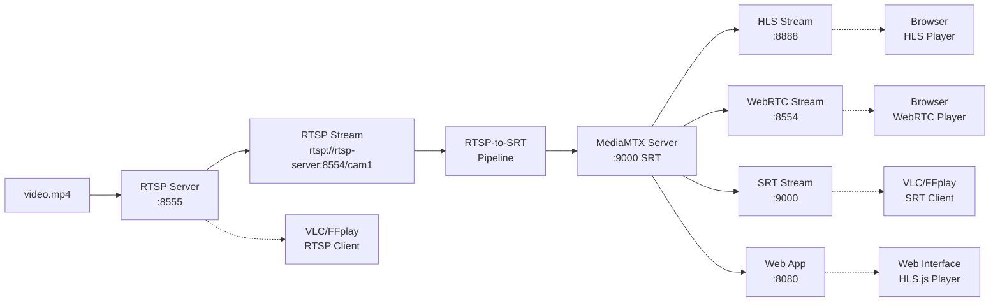

# Paladium Pipeline

Pipeline completo de streaming que converte arquivos MP4 em streams RTSP e depois para SRT, usando GStreamer em Docker.

## 🎯 Visão Geral

O Paladium Pipeline é composto por três serviços integrados:

1. **RTSP Server** (`pipeline-rtsp/`) - Converte MP4 para stream RTSP
2. **RTSP-to-SRT** (`pipeline-rtsp-to-srt/`) - Consome RTSP e publica via SRT
3. **Server** (`server/`) - Recebe SRT e distribui via HLS/WebRTC/SRT

### Fluxo do Pipeline
```
MP4 File → RTSP Server → RTSP Stream → RTSP-to-SRT → MediaMTX Server → HLS/WebRTC/SRT
```

## 🏗️ Arquitetura



### Tecnologias Utilizadas
- **GStreamer**: Pipeline de mídia
- **Docker**: Containerização
- **SRT**: Protocolo de streaming seguro
- **RTSP**: Real Time Streaming Protocol
- **MediaMTX**: Servidor de streaming multi-protocolo
- **HLS**: HTTP Live Streaming
- **WebRTC**: Streaming em tempo real
- **Python**: Scripts de automação e controle

## 🚀 Início Rápido

### Pré-requisitos
- Docker e Docker Compose
- Arquivo `video.mp4` no diretório raiz
- Portas 8080, 8555, 8554, 8888, 9000, 9997, 9998 disponíveis

### Validação
```bash
make validate
```

### Demo Completa
```bash
make demo
```

Isso irá:
1. ✅ Validar pré-requisitos
2. 🔨 Construir as imagens Docker
3. 🚀 Iniciar todos os serviços (RTSP → SRT → MediaMTX)
4. 📺 Disponibilizar streams RTSP, SRT, HLS e WebRTC
5. 🌐 Interface web em http://localhost:8080

## 📋 Comandos Principais

| Comando | Descrição |
|---------|-----------|
| `make help` | Mostrar todos os comandos |
| `make validate` | Validar pré-requisitos |
| `make demo` | Demo completa (recomendado) |
| `make up` | Iniciar pipeline completo |
| `make down` | Parar todos os serviços |
| `make logs` | Ver logs em tempo real |
| `make status` | Status dos containers |
| `make health` | Verificar saúde dos serviços |
| `make clean` | Limpar containers e imagens |

## 🧪 Testando os Streams

### Interface Web (Recomendado)
```bash
# Abrir interface web com player HLS integrado
open http://localhost:8080
```

### Stream RTSP (Pipeline 1)
```bash
# VLC
vlc rtsp://localhost:8555/cam1

# FFplay
ffplay rtsp://localhost:8555/cam1

# GStreamer
gst-launch-1.0 rtspsrc location=rtsp://localhost:8555/cam1 ! autovideosink
```

### Stream SRT (Pipeline 3 - MediaMTX)
```bash
# VLC
vlc "srt://localhost:9000?mode=caller&streamid=#!::r=cam1,m=read"

# FFplay
ffplay "srt://localhost:9000?mode=caller&streamid=#!::r=cam1,m=read"

# GStreamer
gst-launch-1.0 srtclientsrc uri="srt://localhost:9000?streamid=#!::r=cam1,m=read" ! decodebin ! autovideosink
```

### Stream HLS (Pipeline 3 - MediaMTX)
```bash
# VLC
vlc http://localhost:8888/cam1/index.m3u8

# FFplay
ffplay http://localhost:8888/cam1/index.m3u8

# Navegador (via interface web)
open http://localhost:8080
```

### Stream WebRTC (Pipeline 3 - MediaMTX)
```bash
# Player WebRTC do MediaMTX
open http://localhost:8554/cam1

# Ou via interface web, botão "Abrir Player WebRTC"
```

### Testes Automatizados
```bash
make test-rtsp    # Testar saída RTSP (Pipeline 1)
make test-srt     # Testar saída SRT (Pipeline 3)
make test-full    # Testar pipeline completo
# Para testes específicos do servidor MediaMTX:
cd server && make test
```

## ⚙️ Configuração

### Estrutura do Projeto
```
paladium-pipeline/
├── pipeline-rtsp/              # Pipeline 1: Servidor RTSP
│   ├── src/rtsp_server.py
│   ├── Dockerfile
│   └── docker-compose.yml
├── pipeline-rtsp-to-srt/       # Pipeline 2: RTSP→SRT
│   ├── src/rtsp_to_srt.py
│   ├── Dockerfile
│   └── docker-compose.yml
├── server/                     # Pipeline 3: MediaMTX Server
│   ├── Dockerfile
│   ├── docker-compose.yml
│   ├── mediamtx.yml
│   ├── Makefile
│   ├── README.md
│   └── web/                    # Interface web
│       ├── index.html
│       ├── style.css
│       └── app.js
├── docker-compose.yml          # Orquestração principal
├── Makefile                    # Comandos de automação
├── video.mp4                   # Arquivo de vídeo fonte
└── README.md                   # Esta documentação
```

### Configurações dos Serviços

#### Pipeline 1: RTSP Server
- **Porta Externa**: 8555 (mapeada para 8554 interna)
- **Endpoint**: `/cam1`
- **URL Externa**: `rtsp://localhost:8555/cam1`
- **URL Interna**: `rtsp://rtsp-server:8554/cam1`

#### Pipeline 2: RTSP-to-SRT
- **Entrada**: RTSP do Pipeline 1
- **Saída**: SRT para MediaMTX (Pipeline 3)
- **Stream ID**: `#!::r=cam1,m=publish` (formato MediaMTX)

#### Pipeline 3: MediaMTX Server
- **SRT**: Porta 9000 (publish/read)
- **HLS**: Porta 8888
- **WebRTC**: Porta 8554
- **Web App**: Porta 8080
- **API**: Porta 9997
- **Métricas**: Porta 9998

### Personalização

Para alterar configurações, edite o `docker-compose.yml` principal:

```yaml
environment:
  # RTSP Server
  - VIDEO_PATH=/app/video/video.mp4
  - RTSP_PORT=8554
  - MOUNT_POINT=/cam1
  
  # RTSP-to-SRT
  - RTSP_URL=rtsp://rtsp-server:8554/cam1
  - SRT_HOST=0.0.0.0
  - SRT_PORT=9999
  - SRT_STREAMID=live/paladium-stream
```

## 🔄 Dependências e Ordem de Inicialização

O docker-compose principal garante a ordem correta:

1. **RTSP Server** inicia primeiro
2. **Health check** verifica se RTSP está funcionando
3. **RTSP-to-SRT** inicia apenas após RTSP estar saudável
4. **Reconexão automática** em caso de falhas

### Health Checks
- **RTSP Server**: Verifica GStreamer RTSP (`start_period: 15s`)
- **RTSP-to-SRT**: Verifica GStreamer SRT (`start_period: 90s`)

## 📊 Monitoramento

### Logs Estruturados
```bash
# Todos os serviços
make logs

# Apenas RTSP
make logs-rtsp

# Apenas SRT
make logs-srt
```

### Status e Saúde
```bash
# Status dos containers
make status

# Verificação de saúde
make health

# Monitoramento de recursos
make monitor
```

### Métricas Disponíveis
- Estado dos pipelines
- Contadores de reconexão
- Tempo de uptime
- Erros e avisos
- Uso de recursos

## 🛠️ Desenvolvimento

### Comandos de Desenvolvimento
```bash
make dev-build        # Build sem cache
make dev-up          # Up com logs visíveis
make dev-shell-rtsp  # Shell no container RTSP
make dev-shell-srt   # Shell no container SRT
```

### Build Individual
```bash
make build-rtsp      # Apenas imagem RTSP
make build-srt       # Apenas imagem SRT
make build           # Ambas as imagens
```

### Execução Individual
```bash
make up-rtsp         # Apenas servidor RTSP
```

## 🔧 Solução de Problemas

### Pipeline não Inicia
1. **Verificar arquivo de vídeo**:
   ```bash
   make video-info
   ```

2. **Validar pré-requisitos**:
   ```bash
   make validate
   ```

3. **Verificar logs**:
   ```bash
   make logs
   ```

### Problemas de Conectividade
1. **Verificar portas**:
   ```bash
   netstat -tulpn | grep -E "(8554|9999)"
   ```

2. **Testar rede Docker**:
   ```bash
   make network-info
   ```

3. **Health check manual**:
   ```bash
   make health
   ```

### Reconexões Frequentes
- Verificar estabilidade da rede
- Aumentar timeouts nos health checks
- Verificar recursos do sistema

### Problemas de Performance
- Verificar uso de CPU/memória: `make monitor`
- Ajustar qualidade do vídeo fonte
- Otimizar configurações do GStreamer

## 📈 Performance e Otimizações

### Recursos Recomendados
- **CPU**: 2 cores mínimo, 4 cores recomendado
- **RAM**: 2GB mínimo, 4GB recomendado
- **Rede**: 50Mbps para streams HD

### Otimizações Implementadas
- **Jitter buffer** para estabilidade de rede
- **Health checks** para detecção de falhas
- **Restart policies** para alta disponibilidade
- **Logs rotativos** para gestão de espaço
- **Network bridge** para isolamento

## 🤝 Integração com Sistemas Externos

### Como Fonte RTSP
O servidor RTSP pode ser consumido por:
- Sistemas de videoconferência
- CDNs que suportam RTSP
- Aplicações de monitoramento
- Players de mídia

### Como Destino SRT
A saída SRT pode ser enviada para:
- Servidores de streaming (Wowza, Nginx-RTMP)
- CDNs com suporte SRT
- Sistemas de broadcast
- Aplicações de transmissão ao vivo

### Exemplo de Integração
```bash
# Enviar para servidor SRT remoto
export SRT_HOST=streaming-server.com
export SRT_PORT=1935
make up
```

## 📄 Informações Adicionais

### Arquivos de Configuração
- `docker-compose.yml` - Orquestração principal
- `pipeline-rtsp/docker-compose.yml` - Configuração RTSP
- `pipeline-rtsp-to-srt/docker-compose.yml` - Configuração SRT

### Scripts Utilitários
- `pipeline-rtsp/scripts/validate.py` - Validação RTSP
- `pipeline-rtsp-to-srt/scripts/validate.py` - Validação SRT

### Backup e Manutenção
```bash
make backup-logs     # Backup dos logs
make clean          # Limpeza completa
```

## 🆘 Suporte

Para problemas ou dúvidas:
1. Execute `make validate` para verificar pré-requisitos
2. Verifique os logs com `make logs`
3. Teste componentes individuais com `make test-rtsp` e `make test-srt`
4. Consulte a documentação específica de cada pipeline
5. Verifique a seção de solução de problemas

---

**Desenvolvido com ❤️ usando GStreamer, Docker e Python**
