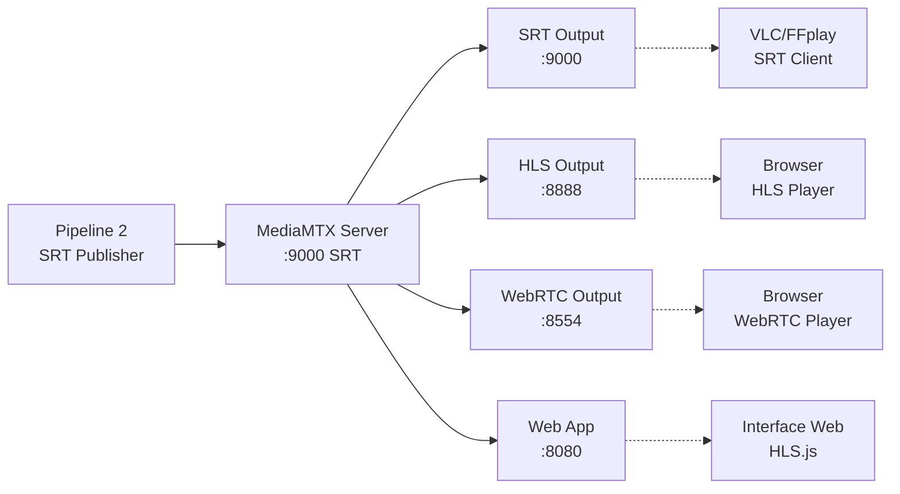

# Paladium Pipeline Server

Servidor de distribuição de vídeo usando **MediaMTX** que recebe streams SRT e os distribui via **SRT**, **HLS** e **WebRTC**.

## 🎯 Visão Geral

O Paladium Pipeline Server é a **Pipeline 3** do projeto, responsável por:

- **Receber streams SRT** da Pipeline 2 (RTSP-to-SRT)
- **Distribuir o mesmo conteúdo** via múltiplos protocolos:
  - **SRT (read)** - Para players como VLC e FFplay
  - **HLS** - Para navegadores web com baixa latência
  - **WebRTC** - Para streaming em tempo real

### Fluxo de Dados
```
Pipeline 2 (SRT publish) → MediaMTX Server → SRT/HLS/WebRTC (read)
```

## 🏗️ Arquitetura



### Tecnologias Utilizadas
- **MediaMTX**: Servidor de streaming multi-protocolo
- **Docker**: Containerização dos serviços
- **HLS.js**: Player HLS para navegadores
- **Nginx**: Servidor web para aplicação estática
- **SRT**: Protocolo de streaming seguro

## 🚀 Início Rápido

### Pré-requisitos
- Docker e Docker Compose
- Pipeline 2 (RTSP-to-SRT) publicando via SRT
- Portas 8080, 8554, 8888 e 9000 disponíveis

### Demo Completa
```bash
# Validar pré-requisitos
make validate

# Iniciar demo completa
make demo
```

Isso irá:
1. ✅ Validar pré-requisitos
2. 🔨 Construir as imagens Docker
3. 🚀 Iniciar MediaMTX e web app
4. 📊 Mostrar status dos serviços
5. 🌐 Disponibilizar todos os endpoints

### Acesso Rápido
Após iniciar com `make demo`:

- **Interface Web**: http://localhost:8080
- **HLS Stream**: http://localhost:8888/cam1/index.m3u8
- **WebRTC Player**: http://localhost:8554/cam1
- **SRT Stream**: `srt://localhost:9000?mode=caller&streamid=#!::r=cam1,m=read`

## 📋 Comandos Principais

| Comando | Descrição |
|---------|-----------|
| `make help` | Mostrar todos os comandos |
| `make demo` | Demo completa (recomendado) |
| `make up` | Iniciar servidor |
| `make down` | Parar servidor |
| `make logs` | Ver logs em tempo real |
| `make status` | Status dos containers |
| `make health` | Verificar saúde dos serviços |
| `make test` | Executar testes |
| `make urls` | Mostrar URLs de acesso |

## 🌐 Interface Web

A interface web em **http://localhost:8080** oferece:

### 📺 Player HLS Integrado
- Player de vídeo com controles completos
- Suporte a HLS com baixa latência
- Controles de áudio (mute/unmute)
- Atalhos de teclado (espaço para play/pause, M para mute)

### ⚙️ Configurações Dinâmicas
- Campo para alterar o **path do stream** (default: `cam1`)
- Campo para alterar o **host do servidor** (default: `localhost`)
- Botão para atualizar URLs automaticamente

### 🔗 URLs Prontas para Uso
- **HLS**: Para uso em players web
- **SRT**: Para VLC, FFplay e outros players
- **WebRTC**: Link direto para o player MediaMTX

### ⚡ Comandos de Teste
- Comandos prontos para copiar e usar no terminal
- Suporte para VLC, FFplay e outros players

### 📊 Monitor de Status
- Status em tempo real dos endpoints
- Verificação automática de conectividade
- Indicadores visuais de saúde dos serviços

## 🧪 Testando os Streams

### Stream HLS (Navegador)
```bash
# Via interface web
open http://localhost:8080

# Via FFplay
ffplay http://localhost:8888/cam1/index.m3u8

# Via curl (verificar disponibilidade)
curl -I http://localhost:8888/cam1/index.m3u8
```

### Stream SRT (Players externos)
```bash
# VLC
vlc "srt://localhost:9000?mode=caller&streamid=#!::r=cam1,m=read"

# FFplay
ffplay "srt://localhost:9000?mode=caller&streamid=#!::r=cam1,m=read"

# GStreamer
gst-launch-1.0 srtclientsrc uri="srt://localhost:9000?streamid=#!::r=cam1,m=read" ! decodebin ! autovideosink
```

### Stream WebRTC (Navegador)
```bash
# Abrir player WebRTC do MediaMTX
open http://localhost:8554/cam1

# Ou via interface web, botão "Abrir Player WebRTC"
```

### Testes Automatizados
```bash
make test           # Todos os testes
make test-hls       # Apenas HLS
make test-srt       # Apenas SRT
make test-webrtc    # Apenas WebRTC
make test-endpoints # Apenas endpoints HTTP
```

## ⚙️ Configuração

### Estrutura do Projeto
```
server/
├── Dockerfile              # Imagem MediaMTX
├── docker-compose.yml      # Orquestração dos serviços
├── mediamtx.yml           # Configuração MediaMTX
├── Makefile               # Comandos de automação
├── env.example            # Variáveis de ambiente
├── README.md              # Esta documentação
└── web/                   # Aplicação web
    ├── index.html         # Interface principal
    ├── style.css          # Estilos CSS
    └── app.js             # Lógica JavaScript/HLS.js
```

### Variáveis de Ambiente

Copie `env.example` para `.env` e ajuste conforme necessário:

```bash
# Configurações principais
STREAM_NAME=cam1           # Nome do path principal
SRT_PORT=9000             # Porta SRT (publish/read)
HLS_PORT=8888             # Porta HLS
WEBRTC_HTTP_PORT=8554     # Porta WebRTC HTTP
WEB_PORT=8080             # Porta da interface web

# Autenticação (opcional, comentado por padrão)
# AUTH_ENABLED=false
# PUBLISH_USER=admin
# PUBLISH_PASS=secret
# READ_USER=viewer
# READ_PASS=123456
```

### Configuração do MediaMTX

O arquivo `mediamtx.yml` configura:

#### Protocolos Habilitados
- **SRT**: Porta 9000 (publish/read)
- **HLS**: Porta 8888 com baixa latência
- **WebRTC**: Porta 8554 com STUN/TURN
- **API**: Porta 9997 para gerenciamento

#### Configurações de Latência
- **HLS**: Modo baixa latência com segmentos de 1s
- **WebRTC**: Configuração otimizada para tempo real
- **SRT**: Buffer otimizado para estabilidade

#### Paths Configurados
- **cam1**: Path principal (configurável via env)
- **Wildcard**: Suporte a múltiplos paths dinâmicos

## 🔄 Integração com Pipeline 2

### Configuração da Pipeline 2

A Pipeline 2 (RTSP-to-SRT) deve publicar usando:

```bash
# URL de publish SRT para MediaMTX
SRT_URL="srt://mediamtx:9000?mode=caller&transtype=live&latency=120&streamid=#!::r=cam1,m=publish"
```

### Formato StreamID

O MediaMTX usa o formato StreamID específico:
- **Publish**: `#!::r=<path>,m=publish`
- **Read**: `#!::r=<path>,m=read`

### Exemplo de Configuração Pipeline 2
```yaml
# docker-compose.yml da Pipeline 2
environment:
  - SRT_HOST=mediamtx  # Nome do container MediaMTX
  - SRT_PORT=9000
  - SRT_STREAMID="#!::r=cam1,m=publish"
```

## 📊 Monitoramento

### Logs Estruturados
```bash
# Todos os serviços
make logs

# Apenas MediaMTX
make logs-mediamtx

# Apenas web app
make logs-web
```

### Status e Saúde
```bash
# Status dos containers
make status

# Verificação de saúde completa
make health

# Monitoramento de recursos
make monitor
```

### APIs de Monitoramento

#### MediaMTX API (Porta 9997)
```bash
# Configuração atual
curl http://localhost:9997/v3/config

# Lista de paths ativos
curl http://localhost:9997/v3/paths/list

# Informações de um path específico
curl http://localhost:9997/v3/paths/get/cam1

# Métricas Prometheus
curl http://localhost:9998/metrics
```

### Health Checks Automáticos

Ambos os serviços possuem health checks:
- **MediaMTX**: Verifica API na porta 9997
- **Web App**: Verifica Nginx na porta 80

## 🔧 Desenvolvimento

### Comandos de Desenvolvimento
```bash
make dev             # Modo desenvolvimento (logs visíveis)
make dev-build       # Build sem cache
make shell-mediamtx  # Shell no container MediaMTX
make shell-web       # Shell no container web
```

### Build Individual
```bash
make build           # Build das imagens
make rebuild         # Rebuild completo com limpeza
```

### Estrutura da Aplicação Web

#### HTML (index.html)
- Interface responsiva e moderna
- Campos configuráveis para path e host
- Player de vídeo com controles completos
- Seções organizadas para URLs e comandos

#### CSS (style.css)
- Design system com variáveis CSS
- Tema moderno com cores consistentes
- Layout responsivo para mobile
- Animações e transições suaves

#### JavaScript (app.js)
- Classe `PaladiumPlayer` para gerenciar HLS
- Integração com HLS.js para streaming
- Sistema de notificações
- Verificação automática de status
- Atalhos de teclado

## 🔒 Segurança

### Autenticação (Opcional)

Para habilitar autenticação, descomente no `mediamtx.yml`:

```yaml
# Autenticação global
publishUser: admin
publishPass: secret
readUser: viewer
readPass: 123456

# Ou por path específico
paths:
  cam1:
    publishUser: admin
    publishPass: secret
    readUser: viewer
    readPass: 123456
```

### CORS e Origens

O MediaMTX está configurado para aceitar qualquer origem:

```yaml
hlsAllowOrigin: "*"
webrtcAllowOrigin: "*"
```

Para produção, configure origens específicas:

```yaml
hlsAllowOrigin: "https://meudominio.com"
webrtcAllowOrigin: "https://meudominio.com"
```

### Rede Docker

Os containers operam em uma rede isolada:
- **Nome**: `paladium-server-network`
- **Driver**: bridge
- **Isolamento**: Containers externos precisam se conectar via IP público

## 🔧 Solução de Problemas

### Servidor não Inicia
1. **Verificar portas**:
   ```bash
   make validate
   netstat -tulpn | grep -E "(8080|8554|8888|9000)"
   ```

2. **Verificar logs**:
   ```bash
   make logs
   ```

3. **Verificar Docker**:
   ```bash
   docker ps
   docker compose ps
   ```

### Stream não Aparece
1. **Verificar se Pipeline 2 está publicando**:
   ```bash
   # No diretório da Pipeline 2
   make logs
   ```

2. **Verificar paths ativos no MediaMTX**:
   ```bash
   curl http://localhost:9997/v3/paths/list
   ```

3. **Testar conexão SRT**:
   ```bash
   nc -z -u localhost 9000
   ```

### Interface Web não Carrega
1. **Verificar container web**:
   ```bash
   docker compose ps web
   make logs-web
   ```

2. **Testar endpoint**:
   ```bash
   curl -I http://localhost:8080
   ```

3. **Verificar arquivos web**:
   ```bash
   ls -la web/
   ```

### HLS não Funciona
1. **Verificar endpoint HLS**:
   ```bash
   curl -I http://localhost:8888/cam1/index.m3u8
   ```

2. **Testar com FFplay**:
   ```bash
   ffplay http://localhost:8888/cam1/index.m3u8
   ```

3. **Verificar logs MediaMTX**:
   ```bash
   make logs-mediamtx | grep -i hls
   ```

### WebRTC não Conecta
1. **Verificar endpoint WebRTC**:
   ```bash
   curl http://localhost:8554/cam1
   ```

2. **Verificar configuração STUN/TURN**:
   ```bash
   curl http://localhost:9997/v3/config | grep -i webrtc
   ```

3. **Testar em navegador diferente**:
   - Chrome/Chromium
   - Firefox
   - Safari

## 📈 Performance e Otimizações

### Recursos Recomendados
- **CPU**: 2 cores mínimo, 4 cores recomendado
- **RAM**: 1GB mínimo, 2GB recomendado
- **Rede**: 100Mbps para múltiplos streams HD
- **Disco**: 10GB para logs e gravações temporárias

### Otimizações Implementadas

#### HLS
- **Baixa latência**: Segmentos de 1s e partes de 200ms
- **Buffer otimizado**: 3 segmentos no buffer
- **Compressão**: Desabilitada para reduzir latência

#### SRT
- **Buffer adaptativo**: Configurado automaticamente
- **Modo caller**: Melhor para NAT traversal
- **Latência**: 120ms balanceada

#### WebRTC
- **STUN/TURN**: Configuração para NAT traversal
- **Codecs**: H.264 otimizado
- **Buffer**: Mínimo para tempo real

### Escalabilidade

Para múltiplos streams simultâneos:

1. **Aumentar recursos**:
   ```yaml
   deploy:
     resources:
       limits:
         cpus: '4'
         memory: 4G
   ```

2. **Configurar múltiplos paths**:
   ```yaml
   paths:
     "cam1": { ... }
     "cam2": { ... }
     "cam3": { ... }
   ```

3. **Load balancing** com Nginx ou HAProxy

## 🤝 Integração com Sistemas Externos

### Como Fonte de Streams

O servidor pode alimentar:
- **CDNs** que suportam SRT/HLS/WebRTC
- **Servidores de streaming** (Wowza, Nginx-RTMP)
- **Sistemas de videoconferência**
- **Aplicações de broadcast**

### Como Destino de Streams

O servidor pode receber de:
- **Pipeline 2** (configuração padrão)
- **OBS Studio** via SRT
- **FFmpeg** via SRT publish
- **Câmeras IP** com SRT

### Exemplo de Integração Externa

#### OBS Studio → MediaMTX
```
# Configuração OBS Studio
Servidor: srt://localhost:9000
Stream Key: #!::r=obs-stream,m=publish
```

#### FFmpeg → MediaMTX
```bash
ffmpeg -re -i input.mp4 -c copy -f mpegts \
  "srt://localhost:9000?streamid=#!::r=ffmpeg-stream,m=publish"
```

## 🆘 Suporte e Troubleshooting

### Checklist de Verificação
1. ✅ Docker e Docker Compose instalados
2. ✅ Portas 8080, 8554, 8888, 9000 livres
3. ✅ Pipeline 2 publicando via SRT
4. ✅ Containers MediaMTX e web rodando
5. ✅ Health checks passando

### Comandos de Diagnóstico
```bash
# Validação completa
make validate

# Status detalhado
make status
make health

# Teste de conectividade
make test

# Informações de rede
make network-info

# URLs de acesso
make urls
```

### Logs Importantes
```bash
# Erro de inicialização
make logs-mediamtx | grep -i error

# Problemas de conexão SRT
make logs-mediamtx | grep -i srt

# Problemas HLS
make logs-mediamtx | grep -i hls

# Problemas WebRTC
make logs-mediamtx | grep -i webrtc
```

### Backup e Recuperação
```bash
# Backup das configurações
make backup-config

# Limpeza completa para reset
make clean

# Rebuild após problemas
make rebuild
```

## 📄 Informações Adicionais

### Arquivos de Configuração
- `mediamtx.yml` - Configuração principal do MediaMTX
- `docker-compose.yml` - Orquestração dos containers
- `env.example` - Template de variáveis de ambiente

### Diretórios de Dados
- `./recordings/` - Gravações (se habilitadas)
- `./web/` - Aplicação web estática

### APIs Disponíveis
- **MediaMTX API**: http://localhost:9997/v3/
- **Métricas Prometheus**: http://localhost:9998/metrics
- **Interface Web**: http://localhost:8080

### Licenças
- **MediaMTX**: MIT License
- **HLS.js**: Apache License 2.0
- **Nginx**: 2-clause BSD License

---

## 🎯 Exemplo de Uso Fim-a-Fim

### 1. Iniciar Pipeline Completa
```bash
# No diretório raiz do projeto
make demo

# No diretório server
make demo
```

### 2. Verificar Status
```bash
make status
make health
```

### 3. Testar Streams
```bash
# Interface web
open http://localhost:8080

# VLC (SRT)
vlc "srt://localhost:9000?mode=caller&streamid=#!::r=cam1,m=read"

# WebRTC
open http://localhost:8554/cam1
```

### 4. Monitorar
```bash
# Logs em tempo real
make logs

# Métricas
curl http://localhost:9998/metrics
```

---

**Desenvolvido com ❤️ para Paladium Pipeline | Powered by MediaMTX & HLS.js**
